<h2>Hi there, I'm Tianshi/Rob! 👋</h2>
<p><em>C++ Application Developer @<a href="https://www.vicon.com/">Vicon Motion Systems Ltd</a></em>🖥️<br>

<span>
  <a href="#"></a>
  <a href="#"></a>
</span>

### ⬇️ A bit about me... </h3>

```cpp
class Rob : public Human {
  public:
    Rob();

    struct Workspace {
      string location { "remote" };
      string platform { "windows" };
      string distro { "win11" };
      string equipment { "fingers" };
    } workspace;

    vector<Language_Type> languages { C, CPP, QML, Python, TypeScript, PSQL };
    vector<string> libs { "Boost", "Qt6", "React", "Angular" };
    vector<Program> tools { {"CMake"}, {"Mercurial"}, {"Git"}, {"Visual Studio"}, {"VSCode"} };
    vector<string> skills { "engineer", "architect",  "TDD", "agile", "communicate", "mentor" };

    static constexpr const char* goal { "Become a Tech Lead working on code which makes a difference." };

  private:
    struct Personal_Info {
      int cat_count { 2 };
      array<string, 2> cat_names { "Alphinaud", "Alisaie" };
      Coffee_Style coffee { Decaf };
      array<string, 5> drinks { "water", "tea", "coffee", "whisky", "beer" };
      vector<string> food { "yes" };
      vector<string> hobbies { "archery", "boxing", "cooking", "music", "mental health advocacy" };
    } m_information;
};
```
</p>
